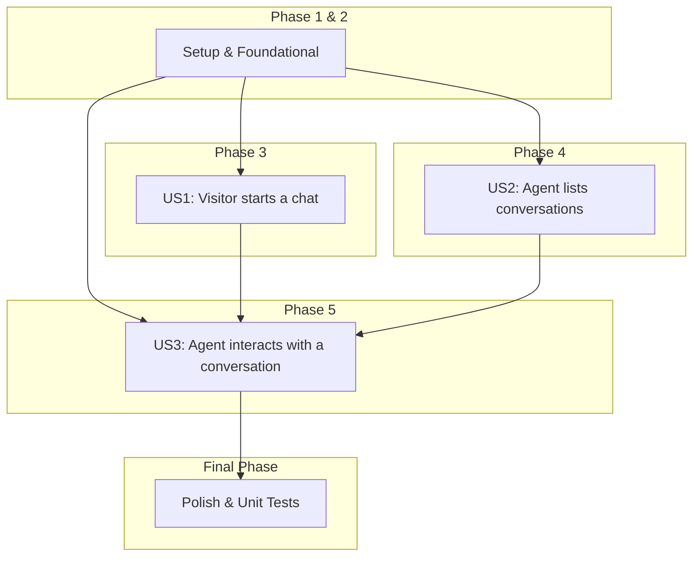

# Tasks: Chat Business Logic

An actionable, dependency-ordered list of tasks to implement the Chat Business Logic feature.

## Implementation Strategy

This feature is broken down into independently implementable and testable user stories. We will start with an MVP (implementing User Story 1) and incrementally deliver the remaining stories. This allows for early integration and testing of the core functionality.

**MVP Scope:** User Story 1 (Visitor starts a chat).

## Dependencies

The user stories should be completed in the following order:

## Parallel Execution

Tasks marked with `[P]` can be executed in parallel *within their phase* to speed up development. For example, in Phase 5, the implementation of different service methods can happen concurrently.

---

## Phase 1: Setup

Tasks to prepare the database schema.

- [ ] T001 Create Supabase migration for `conversations` and `messages` tables in `supabase/migrations/`.
- [ ] T002 Add RLS policies to `conversations` and `messages` tables to enforce tenant isolation.

---

## Phase 2: Foundational Components

Core data structures needed across the feature.

- [ ] T003 [P] Create `Conversation.java` DTO in `backend/src/main/java/com/minintercom/dto/`.
- [ ] T004 [P] Create `Message.java` DTO in `backend/src/main/java/com/minintercom/dto/`.

---

## Phase 3: User Story 1 - Visitor starts a chat

- **Goal**: A visitor can send the first message to create a new conversation.
- **Independent Test Criteria**: A `POST` request to `/api/conversations` with an initial message successfully creates a `conversation` and a `message` record in the database, associated with the correct tenant.

- [ ] T005 [US1] Implement `createConversation` method in `ConversationService.java` at `backend/src/main/java/com/minintercom/services/`.
- [ ] T006 [US1] Implement visitor-specific logic in `sendMessage` method in `MessageService.java` at `backend/src/main/java/com/minintercom/services/`.
- [ ] T007 [US1] Implement `doPost` for `/api/conversations` in `ChatServlet.java` at `backend/src/main/java/com/minintercom/servlets/`.
- [ ] T008 [US1] Add integration test for `POST /api/conversations` endpoint.

---

## Phase 4: User Story 2 - Agent lists conversations

- **Goal**: An authenticated agent can retrieve a list of conversations for their tenant only.
- **Independent Test Criteria**: A `GET` request to `/api/conversations` with a valid agent JWT returns a 200 response with a list of conversations scoped to the agent's tenant.

- [ ] T009 [US2] Implement `listConversations` method in `ConversationService.java`.
- [ ] T010 [US2] Implement `doGet` for `/api/conversations` in `ChatServlet.java`.
- [ ] T011 [US2] Add integration test for `GET /api/conversations` to verify functionality and tenant isolation.

---

## Phase 5: User Story 3 - Agent interacts with a conversation

- **Goal**: An agent can reply to conversations, retrieve message history, and change conversation status.
- **Independent Test Criteria**:
    - `POST` to `/api/conversations/{id}/messages` as an agent adds a message.
    - `GET` to `/api/conversations/{id}/messages` retrieves the conversation history.
    - `PUT` to `/api/conversations/{id}/status` correctly updates the conversation's status.

- [ ] T012 [P] [US3] Implement agent-specific logic in `sendMessage` method in `MessageService.java`.
- [ ] T013 [P] [US3] Implement `getMessageHistory` method in `MessageService.java`.
- [ ] T014 [P] [US3] Implement `updateConversationStatus` method in `ConversationService.java`.
- [ ] T015 [US3] Implement `doPost` for `/api/conversations/{id}/messages` in `ChatServlet.java`.
- [ ] T016 [US3] Implement `doGet` for `/api/conversations/{id}/messages` in `ChatServlet.java`.
- [ ] T017 [US3] Implement `doPut` for `/api/conversations/{id}/status` in `ChatServlet.java`.
- [ ] T018 [US3] Add integration tests for all endpoints in this user story.

---

## Final Phase: Polish & Cross-Cutting Concerns

Finalizing tests and ensuring code quality.

- [ ] T019 [P] Write unit tests for `ConversationService.java` logic.
- [ ] T020 [P] Write unit tests for `MessageService.java` logic.
- [ ] T021 Review and confirm all new database queries in services use `TenantContext` correctly.
