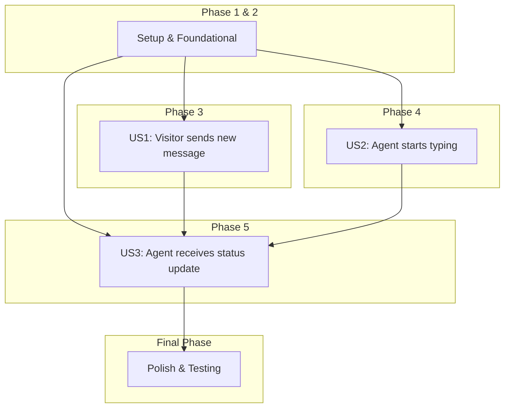

# Tasks: Real-Time Relay

An actionable, dependency-ordered list of tasks to implement the Real-Time Relay feature.

## Implementation Strategy

This feature will be implemented incrementally, starting with foundational components and then building out functionality per user story. Performance and reliability will be verified through dedicated testing phases.

**MVP Scope:** Phase 1: Setup and Phase 2: Foundational Components.

## Dependencies

The user stories should be completed in the following order:

## Parallel Execution

Tasks marked with `[P]` can be executed in parallel *within their phase* to speed up development. For example, implementing different event types or client/server components can happen concurrently where dependencies allow.

---

## Phase 1: Setup & Protocol Definition

This phase covers initial project setup and defining the core real-time communication protocol.

- [ ] T001 Define the custom TCP-based real-time protocol specification in `specs/004-real-time-relay/protocol.md` (or similar document).
- [ ] T002 Create base directories for new components (e.g., `backend/src/main/java/com/minintercom/realtime/server`, `backend/src/main/java/com/minintercom/realtime/client`, `backend/src/main/java/com/minintercom/realtime/router`, `backend/src/main/java/com/minintercom/realtime/pollqueue`).

---

## Phase 2: Foundational Components & Event Structures

This phase focuses on core components and event data structures, providing a base for user story implementation.

- [ ] T003 [P] Create `RealtimeEvent.java` base interface/class in `backend/src/main/java/com/minintercom/realtime/events/`.
- [ ] T004 [P] Implement `NewMessageEvent.java` data structure based on `data-model.md` in `backend/src/main/java/com/minintercom/realtime/events/`.
- [ ] T005 [P] Implement `AgentTypingEvent.java` data structure based on `data-model.md` in `backend/src/main/java/com/minintercom/realtime/events/`.
- [ ] T006 [P] Implement `ConversationStatusUpdateEvent.java` data structure based on `data-model.md` in `backend/src/main/java/com/minintercom/realtime/events/`.
- [ ] T007 Implement the core real-time server component (e.g., `RealtimeServer.java`) for accepting connections and managing a thread pool in `backend/src/main/java/com/minintercom/realtime/server/`.
- [ ] T008 Implement generic client connection handler (e.g., `ClientConnectionHandler.java`) for the real-time server in `backend/src/main/java/com/minintercom/realtime/server/`.
- [ ] T009 Implement the core event routing component (e.g., `EventRouter.java`) for managing subscribers in `backend/src/main/java/com/minintercom/realtime/router/`.
- [ ] T010 Implement the core backend client component (e.g., `RealtimeClient.java`) for connecting to the real-time server and publishing events in `backend/src/main/java/com/minintercom/realtime/client/`.
- [ ] T011 Implement basic connection retry logic in `RealtimeClient.java`.
- [ ] T012 Implement the core event queue service (e.g., `PollQueueService.java`) for managing isolated event queues in `backend/src/main/java/com/minintercom/realtime/pollqueue/`.

---

## Phase 3: User Story 1 - Visitor sends new message

- **Goal**: A visitor's new message is published as an event and routed to subscribed agents.
- **Independent Test Criteria**: A successful message submission in the chat system triggers a `new_message` event that is correctly formatted, published via the Real-Time Client, and delivered to relevant subscribed agents with minimal latency.

- [ ] T013 [US1] Update chat service (e.g., `MessageService.java`) to trigger `RealtimeClient` to publish `NewMessageEvent` upon message persistence.
- [ ] T014 [US1] Extend `RealtimeServer` to parse incoming `NewMessageEvent` via the defined protocol.
- [ ] T015 [US1] Extend `EventRouter` to intelligently route `NewMessageEvent` to subscribed agents/clients based on `conversationId` and `tenantId`.
- [ ] T016 [US1] Add integration test for end-to-end `NewMessageEvent` flow.

---

## Phase 4: User Story 2 - Agent starts typing

- **Goal**: An `agent_typing` event is published and routed to relevant parties (visitor, other agents).
- **Independent Test Criteria**: An agent typing action triggers an `agent_typing` event which is correctly published via the Real-Time Client and delivered to relevant subscribers (visitor/other agents) with minimal latency and no persistence.

- [ ] T017 [US2] Create or update frontend logic to publish `AgentTypingEvent` via `RealtimeClient` (or equivalent mechanism).
- [ ] T018 [US2] Extend `RealtimeServer` to parse incoming `AgentTypingEvent` via the defined protocol.
- [ ] T019 [US2] Extend `EventRouter` to intelligently route `AgentTypingEvent` to subscribed agents/clients and visitor based on `conversationId` and `tenantId`.
- [ ] T020 [US2] Add integration test for end-to-end `AgentTypingEvent` flow.

---

## Phase 5: User Story 3 - Agent receives status update & Poll Queue API

- **Goal**: Conversation status updates are published as events and routed, and clients can long-poll for events.
- **Independent Test Criteria**: A conversation status change triggers a `conversation_status_update` event correctly routed to subscribed agents. The `GET /api/realtime/poll` endpoint successfully returns pending events or times out gracefully.

- [ ] T021 [US3] Update conversation service (e.g., `ConversationService.java`) to trigger `RealtimeClient` to publish `ConversationStatusUpdateEvent` upon status change.
- [ ] T022 [US3] Extend `RealtimeServer` to parse incoming `ConversationStatusUpdateEvent` via the defined protocol.
- [ ] T023 [US3] Extend `EventRouter` to intelligently route `ConversationStatusUpdateEvent` to subscribed agents/clients.
- [ ] T024 [US3] Implement `GET /api/realtime/poll` endpoint using `PollQueueService` in a new `RealtimeServlet.java` (or integrate into an existing servlet).
- [ ] T025 [US3] Add integration test for end-to-end `ConversationStatusUpdateEvent` flow.
- [ ] T026 [US3] Add integration test for `GET /api/realtime/poll` endpoint, including timeout and event retrieval.

---

## Final Phase: Polish & Comprehensive Testing

Ensuring robustness, performance, and adherence to principles.

- [ ] T027 [P] Implement comprehensive unit tests for `RealtimeServer` components.
- [ ] T028 [P] Implement comprehensive unit tests for `EventRouter` logic.
- [ ] T029 [P] Implement comprehensive unit tests for `RealtimeClient` logic.
- [ ] T030 [P] Implement comprehensive unit tests for `PollQueueService` logic.
- [ ] T031 Refine `ClientConnectionHandler` to enforce tenant isolation and security using `TenantContext`.
- [ ] T032 Conduct comprehensive load and performance tests against success criteria (P95 latency, concurrent connections).
- [ ] T033 Review and ensure all event flows adhere to Principle 2 (Strict Tenant Isolation).
- [ ] T034 Update `quickstart.md` with examples for interacting with the custom real-time protocol (if applicable).
